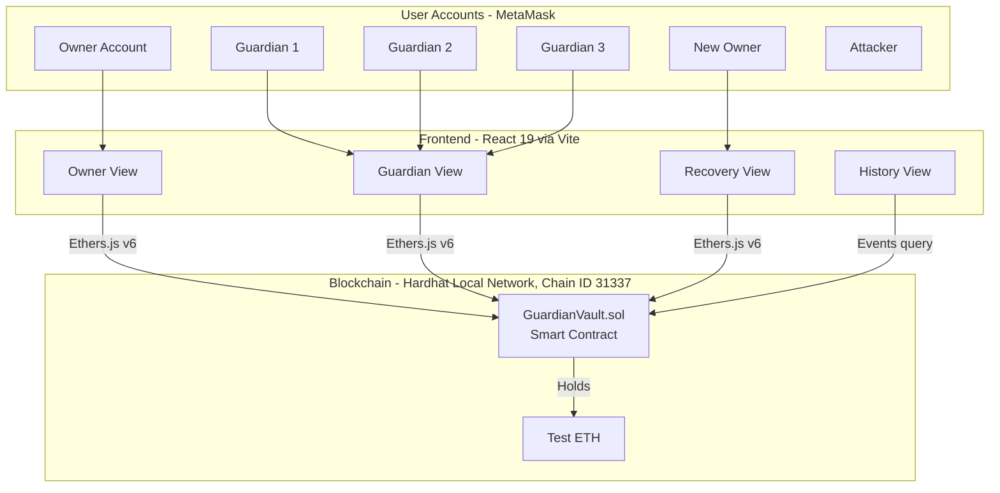
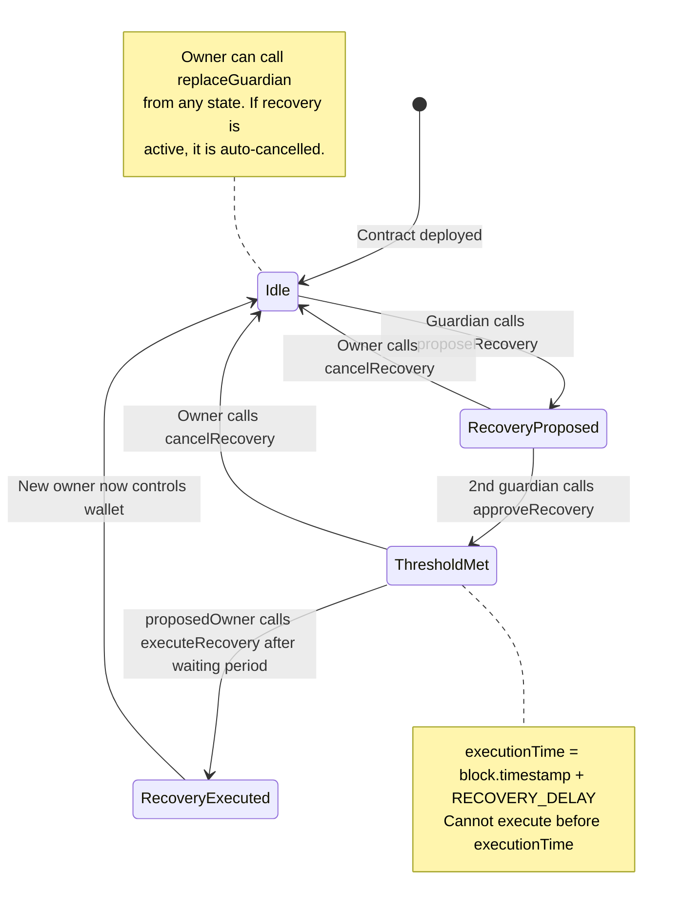

# GuardianVault — Corrected Implementation Document (v3)

> [!NOTE]
> This is the final corrected version of the implementation plan. All review issues from v1 and v2 have been addressed. Changes are marked with **[CORRECTED]** labels.

## Table of Contents

1. [Project Overview](#1-project-overview)
2. [Architecture](#2-architecture)
3. [Smart Contract Design](#3-smart-contract-design)
4. [Frontend Design](#4-frontend-design)
5. [Security Test Plan](#5-security-test-plan)
6. [Gas Analysis Plan](#6-gas-analysis-plan)
7. [Project File Structure](#7-project-file-structure)
8. [Development Workflow](#8-development-workflow)
9. [Presentation Demo Script](#9-presentation-demo-script)
10. [Known Limitations](#10-known-limitations)

---

## 1. Project Overview

### Problem
When a user loses the private key controlling their Ethereum account, all funds in that account are permanently inaccessible. Standard Ethereum accounts have no built-in recovery mechanism — there is no "forgot password" option.

### Solution
A **smart-contract wallet** that holds funds and enforces guardian-assisted recovery rules on-chain. The contract acts as the wallet — it receives, holds, and sends Ether. If the owner loses their key, a predefined group of trusted guardians can authorize a replacement owner through a multi-approval process with a mandatory waiting period. The owner can also replace guardians while retaining access, preventing the guardian pool from degrading over time.

### Tech Stack — **[CORRECTED]** Exact Versions Specified

| Component | Technology | Version | Purpose |
|---|---|---|---|
| Smart Contract | Solidity | ^0.8.24 | Wallet logic, recovery rules |
| Development Framework | Hardhat | 2.x (latest) | Compilation, testing, local blockchain |
| Hardhat Plugin | @nomicfoundation/hardhat-toolbox | latest compatible with Hardhat 2 | Ethers, Chai, gas reporter, coverage |
| Blockchain Library | Ethers.js | v6 | Contract interaction (tests + frontend) |
| Frontend Framework | React | 19 (via Vite) | User interface |
| Wallet Integration | MetaMask | Browser extension | Account switching, transaction signing |
| Styling | Vanilla CSS | — | UI design |
| Network | Hardhat local node | Chain ID 31337 | Development & demo |

#### **[CORRECTED]** Hardhat Setup Commands

```bash
# 1. Initialize project
mkdir GuardianVault && cd GuardianVault
npm init -y

# 2. Install Hardhat 2 and toolbox (hh2 tag required for Hardhat 2)
npm install --save-dev hardhat@2 @nomicfoundation/hardhat-toolbox@hh2

# 3. Initialize Hardhat (select "Create a JavaScript project")
npx hardhat init

# 4. Verify installation
npx hardhat compile
```

#### **[CORRECTED]** hardhat.config.js

```javascript
require("@nomicfoundation/hardhat-toolbox");

/** @type import('hardhat/config').HardhatUserConfig */
module.exports = {
  solidity: "0.8.24",
  networks: {
    hardhat: {
      chainId: 31337,
    },
    localhost: {
      url: "http://127.0.0.1:8545",
      chainId: 31337,
    },
  },
};
```

---

## 2. Architecture

### System Diagram



### Account Roles (Hardhat Default Accounts)

| Account Index | Role | Purpose |
|---|---|---|
| `accounts[0]` | Owner | Deploys contract, manages wallet |
| `accounts[1]` | Guardian 1 | Trusted recovery approver |
| `accounts[2]` | Guardian 2 | Trusted recovery approver |
| `accounts[3]` | Guardian 3 | Trusted recovery approver |
| `accounts[4]` | New Owner | Replacement owner during recovery |
| `accounts[5]` | Attacker | Unauthorized account for security tests |

---

## 3. Smart Contract Design

### 3.1 Contract: `GuardianVault.sol`

#### State Variables

```solidity
// SPDX-License-Identifier: MIT
pragma solidity ^0.8.24;

contract GuardianVault {

    // ── Core State ──
    address public owner;
    uint256 public constant REQUIRED_APPROVALS = 2;
    uint256 public constant RECOVERY_DELAY = 3 days;
    //   For demo/testing, tests use Hardhat's evm_increaseTime
    //   to fast-forward past this delay. The contract always
    //   enforces the full 3-day delay; tests manipulate the
    //   block timestamp, not the contract logic.

    // ── Guardian Management ──
    address[3] public guardians;
    mapping(address => bool) public isGuardian;

    // ── Recovery State ──
    struct RecoveryRequest {
        address proposedOwner;
        uint256 approvalCount;
        uint256 executionTime;      // 0 until threshold is met
        bool active;
        uint256 requestId;
    }

    RecoveryRequest public recoveryRequest;
    uint256 public currentRequestId;

    // Track which guardian approved which request
    mapping(address => uint256) public guardianApprovedRequestId;

    // ── Events ──
    event Deposited(address indexed sender, uint256 amount);
    event Transferred(address indexed to, uint256 amount);
    event RecoveryProposed(address indexed guardian, address indexed proposedOwner, uint256 requestId);
    event RecoveryApproved(address indexed guardian, address indexed proposedOwner, uint256 approvalCount);
    event RecoveryCancelled(address indexed cancelledBy, uint256 requestId);
    event RecoveryExecuted(address indexed oldOwner, address indexed newOwner);
    event GuardianReplaced(address indexed oldGuardian, address indexed newGuardian);
    event GuardianVaultDeployed(address indexed owner, address[3] guardians);
}
```

#### Modifiers

```solidity
modifier onlyOwner() {
    require(msg.sender == owner, "Not the owner");
    _;
}

modifier onlyGuardian() {
    require(isGuardian[msg.sender], "Not a guardian");
    _;
}
```

#### Constructor

```solidity
constructor(address[3] memory _guardians) {
    require(
        _guardians[0] != address(0) &&
        _guardians[1] != address(0) &&
        _guardians[2] != address(0),
        "Guardian cannot be zero address"
    );
    require(
        _guardians[0] != _guardians[1] &&
        _guardians[1] != _guardians[2] &&
        _guardians[0] != _guardians[2],
        "Guardians must be unique"
    );
    require(
        msg.sender != _guardians[0] &&
        msg.sender != _guardians[1] &&
        msg.sender != _guardians[2],
        "Owner cannot be a guardian"
    );

    owner = msg.sender;
    guardians = _guardians;
    isGuardian[_guardians[0]] = true;
    isGuardian[_guardians[1]] = true;
    isGuardian[_guardians[2]] = true;
    currentRequestId = 0;

    emit GuardianVaultDeployed(msg.sender, _guardians);
}
```

#### Functions

| Function | Access | Description |
|---|---|---|
| `receive()` | Anyone | Accept ETH deposits |
| `deposit()` | Anyone | Accept ETH deposits (explicit) |
| `transfer(address to, uint256 amount)` | Owner only | Send ETH from the wallet |
| `getBalance()` | Anyone | View wallet balance |
| `proposeRecovery(address newOwner)` | Guardian only | Start a recovery request |
| `approveRecovery(address newOwner)` | Guardian only | Approve an active recovery request |
| `cancelRecovery()` | Owner only | Cancel the active recovery request |
| `executeRecovery()` | Proposed new owner only | Finalize recovery after waiting period |
| `replaceGuardian(address oldGuardian, address newGuardian)` | Owner only | **[NEW]** Swap a guardian while owner has access |
| `getRecoveryDetails()` | Anyone | View current recovery state |
| `getGuardians()` | Anyone | Return the three guardian addresses |

#### Function Logic — Detailed

**`receive()` and `deposit()`**
```solidity
receive() external payable {
    emit Deposited(msg.sender, msg.value);
}

function deposit() external payable {
    require(msg.value > 0, "Must send ETH");
    emit Deposited(msg.sender, msg.value);
}
```

**`transfer(address to, uint256 amount)`**
```
Preconditions:
  - Caller is the current owner
  - to is not the zero address
  - amount > 0
  - amount <= contract balance

Effects:
  - Send 'amount' ETH to 'to' via call
  - Revert if the low-level call fails
  - Emit Transferred event
```

**`getBalance()`**
```solidity
function getBalance() external view returns (uint256) {
    return address(this).balance;
}
```

**`proposeRecovery(address newOwner)`**
```
Preconditions:
  - Caller is a guardian
  - No active recovery request exists
  - newOwner is not the zero address
  - newOwner is not the current owner
  - newOwner is not a guardian

Effects:
  - Increment currentRequestId
  - Create new RecoveryRequest with:
    - proposedOwner = newOwner
    - approvalCount = 1 (the proposer auto-approves)
    - executionTime = 0 (set when threshold is met)
    - active = true
    - requestId = currentRequestId
  - Record proposer's approval: guardianApprovedRequestId[msg.sender] = currentRequestId
  - Emit RecoveryProposed event
```

**`approveRecovery(address newOwner)`**
```
Preconditions:
  - Caller is a guardian
  - Active recovery request exists
  - newOwner matches recoveryRequest.proposedOwner
  - Guardian has NOT already approved this requestId
    (guardianApprovedRequestId[msg.sender] != currentRequestId)

Effects:
  - Increment approvalCount
  - Record guardian's approval: guardianApprovedRequestId[msg.sender] = currentRequestId
  - If approvalCount >= REQUIRED_APPROVALS and executionTime == 0:
    - Set executionTime = block.timestamp + RECOVERY_DELAY
  - Emit RecoveryApproved event
```

**`cancelRecovery()`**
```
Preconditions:
  - Caller is the current owner
  - Active recovery request exists

Effects:
  - Set recoveryRequest.active = false
  - Note: currentRequestId is NOT decremented — this invalidates all
    approvals tied to the old requestId, preventing replay
  - Emit RecoveryCancelled event
```

**`executeRecovery()`**
```
Preconditions:
  - Caller is the proposedOwner
  - Active recovery request exists
  - approvalCount >= REQUIRED_APPROVALS
  - executionTime > 0
  - block.timestamp >= executionTime

Effects:
  - Store old owner address (for event)
  - Set owner = recoveryRequest.proposedOwner
  - Set recoveryRequest.active = false
  - Emit RecoveryExecuted event
```

**`replaceGuardian(address oldGuardian, address newGuardian)` — [NEW, CORRECTED in v3]**
```
Preconditions:
  - Caller is the current owner
  - oldGuardian is a current guardian (isGuardian[oldGuardian] == true)
  - newGuardian is not the zero address
  - newGuardian is not the current owner
  - newGuardian is not already a guardian
  - newGuardian is not the same as oldGuardian

Effects:
  - If an active recovery request exists, cancel it automatically
    (set recoveryRequest.active = false, emit RecoveryCancelled)
  - Set isGuardian[oldGuardian] = false
  - Set isGuardian[newGuardian] = true
  - Find oldGuardian in the guardians[3] array and replace with newGuardian
  - Emit GuardianReplaced event
```

> [!IMPORTANT]
> **[CORRECTED v3] Why auto-cancel on replacement:** The v2 design blocked guardian replacement during active recovery. This had a weakness: a compromised guardian could keep proposing recovery to obstruct their own replacement. Since the owner can already cancel any request, the cleaner rule is: replacing a guardian **automatically cancels** any active recovery in the same transaction. This removes the obstruction vector while keeping the guardian set consistent.

### 3.2 State Machine



### 3.3 Replay / Stale Approval Prevention

The `requestId` mechanism is critical:

```
Request #1 created → Guardian A approves (tied to requestId 1)
Owner cancels   → request deactivated, but requestId stays at 1
Request #2 created → currentRequestId becomes 2
Guardian A's old approval is tied to requestId 1, NOT requestId 2
Guardian A must approve again for request #2
```

This prevents an attacker from reusing old approvals after a cancellation.

### 3.4 Comparison Contract: `SimpleWallet.sol`

A minimal owner-only wallet with no recovery mechanism. Used to demonstrate
that a plain wallet cannot recover funds after key loss, and to compare gas costs.

```solidity
// SPDX-License-Identifier: MIT
pragma solidity ^0.8.24;

contract SimpleWallet {
    address public owner;

    event Deposited(address indexed sender, uint256 amount);
    event Transferred(address indexed to, uint256 amount);

    constructor() {
        owner = msg.sender;
    }

    modifier onlyOwner() {
        require(msg.sender == owner, "Not the owner");
        _;
    }

    receive() external payable {
        emit Deposited(msg.sender, msg.value);
    }

    function transfer(address to, uint256 amount) external onlyOwner {
        require(to != address(0), "Cannot transfer to zero address");
        require(amount > 0 && amount <= address(this).balance, "Invalid amount");
        (bool success, ) = to.call{value: amount}("");
        require(success, "Transfer failed");
        emit Transferred(to, amount);
    }

    function getBalance() external view returns (uint256) {
        return address(this).balance;
    }
}
```

---

## 4. Frontend Design

### 4.1 Technology Setup

- **React 19** via Vite (current `create-vite --template react` scaffolds React 19)
- **Ethers.js v6** for blockchain interaction
- **Vanilla CSS** with a dark theme, glassmorphism cards, and smooth animations
- **MetaMask** for account switching

#### **[CORRECTED]** Frontend Initialization

```bash
cd GuardianVault
npm create vite@latest frontend -- --template react
cd frontend
npm install
npm install ethers@6
```

> [!NOTE]
> **[CORRECTED v3]** The current `create-vite --template react` scaffolds React 19, not React 18. The project uses React 19 as installed.

### 4.2 Page Layout

```
┌──────────────────────────────────────────────────────┐
│  🛡️ GuardianVault                        [Connected] │
│  ─────────────────────────────────────────────────── │
│  [Owner] [Guardian] [Recovery] [History]              │
│  ─────────────────────────────────────────────────── │
│                                                       │
│  ┌─────────────────────────────────────────────────┐ │
│  │                                                  │ │
│  │           (Active Tab Content)                   │ │
│  │                                                  │ │
│  └─────────────────────────────────────────────────┘ │
│                                                       │
│  Status: Owner: 0x1234...  |  Balance: 5.0 ETH       │
└──────────────────────────────────────────────────────┘
```

### 4.3 Tab Details

#### Tab 1: Owner View
```
┌─────────────────────────────────────────┐
│  💰 Wallet Balance: 5.0 ETH            │
│                                          │
│  ── Transfer Funds ──                    │
│  Recipient: [0x____________]             │
│  Amount:    [____] ETH                   │
│  [Send Transaction]                      │
│                                          │
│  ── Guardian Management ──               │
│  Guardian 1: 0x1111...                   │
│  Guardian 2: 0x2222...                   │
│  Guardian 3: 0x3333...                   │
│  Old Guardian: [0x____]  New: [0x____]   │
│  [Replace Guardian]                      │
│                                          │
│  ── Recovery Status ──                   │
│  Status: ⚠️ Active recovery pending     │
│  Proposed owner: 0xABCD...               │
│  Approvals: 2/2                          │
│  Time remaining: 2d 15h 30m              │
│  [❌ Cancel Recovery]                    │
└─────────────────────────────────────────┘
```

#### Tab 2: Guardian View
```
┌─────────────────────────────────────────┐
│  🔐 Guardian Panel                      │
│  Connected as: Guardian 2 (0x2222...)    │
│                                          │
│  ── Propose Recovery ──                  │
│  New Owner Address: [0x____________]     │
│  [Propose Recovery]                      │
│                                          │
│  ── Active Recovery ──                   │
│  Proposed owner: 0xABCD...               │
│  Approvals: 1/2 (need 1 more)           │
│  Your status: ⏳ Not yet approved        │
│  [✅ Approve Recovery]                   │
└─────────────────────────────────────────┘
```

#### Tab 3: Recovery View
```
┌─────────────────────────────────────────┐
│  🔄 Recovery Status                     │
│                                          │
│  ── Current Recovery Request ──          │
│  Proposed Owner: 0xABCD...               │
│  Approval Progress: ██████████░░ 2/2    │
│                                          │
│  ── Waiting Period ──                    │
│  ⏱️ Time remaining: 2d 15h 30m          │
│  ████████░░░░░░░░ 58% elapsed           │
│                                          │
│  [Execute Recovery]                      │
│  (Button disabled until time elapsed)    │
│                                          │
│  ── Recovery Rules ──                    │
│  • 2 of 3 guardians must approve         │
│  • 3-day waiting period after approval   │
│  • Owner can cancel anytime before exec  │
│  • Only proposed owner can execute       │
└─────────────────────────────────────────┘
```

#### Tab 4: History View
```
┌─────────────────────────────────────────┐
│  📜 Transaction History                 │
│                                          │
│  ── All Events ──                        │
│  🟢 Deposit    | 5.0 ETH  | 0x1234...  │
│  🔵 Transfer   | 1.0 ETH  | → 0x5678  │
│  🟡 Recovery Proposed | Guardian 1      │
│  🟡 Recovery Approved | Guardian 2      │
│  🔴 Recovery Cancelled | Owner          │
│  🟡 Recovery Proposed | Guardian 3      │
│  🟡 Recovery Approved | Guardian 1      │
│  🟢 Recovery Executed | New Owner       │
│  🔵 Transfer   | 2.0 ETH  | → 0x9999  │
│  🟣 Guardian Replaced | G2 → G4        │
└─────────────────────────────────────────┘
```

### 4.4 UI Design Tokens

```css
/* Color Palette */
--bg-primary:     #0a0e1a;
--bg-card:        rgba(15, 23, 42, 0.8);
--accent-blue:    #3b82f6;
--accent-green:   #10b981;
--accent-red:     #ef4444;
--accent-yellow:  #f59e0b;
--accent-purple:  #8b5cf6;
--text-primary:   #f1f5f9;
--text-secondary: #94a3b8;
--border:         rgba(148, 163, 184, 0.1);
--glass-blur:     blur(20px);
```

### 4.5 Key Frontend Components — **[CORRECTED]** Vite File Layout

Per the [Vite guide](https://vite.dev/guide/), `index.html` must be at the **project root**, not inside `public/`. Vite treats `index.html` as the entry point and processes it as source code.

```
frontend/                          ← Vite project root
├── index.html                     ← [CORRECTED] At project root, not public/
├── package.json
├── vite.config.js
├── public/                        ← Static assets only (favicon, etc.)
│   └── favicon.svg
└── src/
    ├── App.jsx
    ├── main.jsx
    ├── index.css
    ├── hooks/
    │   ├── useContract.js
    │   └── useWalletConnect.js
    ├── components/
    │   ├── Header.jsx
    │   ├── TabNav.jsx
    │   ├── OwnerView.jsx
    │   ├── GuardianView.jsx
    │   ├── RecoveryView.jsx
    │   ├── HistoryView.jsx
    │   ├── StatusBar.jsx
    │   └── CountdownTimer.jsx
    ├── utils/
    │   ├── contractAddress.js
    │   └── formatters.js
    └── abi/
        └── GuardianVault.json
```

---

## 5. Security Test Plan

> [!WARNING]
> **[CORRECTED]** All items below are **planned tests with expected outcomes**. Results will only be reported after the tests are written, executed, and pass. No claims of "all blocked" are made until evidenced by `npx hardhat test` output.

### 5.1 Planned Security Tests (7 defence scenarios + 1 successful recovery)

#### Test 1: Outsider cannot transfer funds (Defence)
```
Setup:    Deploy contract, owner deposits 5 ETH
Action:   Attacker (accounts[5]) calls transfer(attacker, 1 ETH)
Expected: Transaction reverts with "Not the owner"
Tests:    Only the owner can move funds
```

#### Test 2: Outsider cannot propose recovery (Defence)
```
Setup:    Deploy contract
Action:   Attacker calls proposeRecovery(attacker)
Expected: Transaction reverts with "Not a guardian"
Tests:    Only registered guardians can initiate recovery
```

#### Test 3: One guardian cannot meet threshold (Defence)
```
Setup:    Deploy contract, Guardian 1 proposes recovery
Action:   Proposed new owner calls executeRecovery()
Expected: Transaction reverts (approvalCount < 2, executionTime == 0)
Tests:    Single guardian is insufficient — threshold requires 2
```

#### Test 4: Same guardian cannot approve twice (Defence)
```
Setup:    Guardian 1 proposes recovery
Action:   Guardian 1 calls approveRecovery() again
Expected: Transaction reverts with "Already approved this request"
Tests:    Duplicate approvals from the same guardian are rejected
```

#### Test 5: Recovery cannot execute before waiting period (Defence)
```
Setup:    Guardian 1 proposes, Guardian 2 approves (threshold met, timer starts)
Action:   Proposed owner calls executeRecovery() immediately
Expected: Transaction reverts with "Waiting period not elapsed"
Note:     The contract uses RECOVERY_DELAY = 3 days. Tests use
          Hardhat's helpers.time.increase(3 * 24 * 60 * 60) to
          fast-forward past the delay.
Tests:    Time-lock is enforced on-chain
```

#### Test 6: Owner can cancel active recovery (Defence)
```
Setup:    Guardian 1 proposes, Guardian 2 approves
Action:   Owner calls cancelRecovery()
Expected: Recovery request deactivated, all approvals invalidated
Verify:   A new proposeRecovery() starts fresh with approvalCount = 1
Tests:    Owner retains emergency cancel authority
```

#### Test 7: Cancelled approvals cannot be reused (Defence)
```
Setup:    Guardian 1 proposes (request #1), Guardian 2 approves, owner cancels
Action:   Guardian 3 proposes new recovery (request #2)
Verify:   Guardian 2's old approval does NOT count toward request #2
Expected: approvalCount for request #2 = 1 (only Guardian 3's proposal)
Tests:    requestId mechanism prevents replay of stale approvals
```

#### Test 8: Full successful recovery (Functional — not a defence test)
```
Setup:    Deploy contract, owner deposits 5 ETH, owner key is "lost"
Steps:
  1. Guardian 1 proposes newOwner (accounts[4])
  2. Guardian 2 approves newOwner
  3. Use helpers.time.increase(3 * 24 * 60 * 60) to advance past delay
  4. newOwner calls executeRecovery()
  5. newOwner calls transfer(someAddress, 1 ETH) → succeeds
  6. oldOwner calls transfer(someAddress, 1 ETH) → reverts
Tests:    End-to-end recovery works; ownership fully transfers
```

> [!NOTE]
> **[CORRECTED]** Test 8 is a **successful recovery**, not an attack defence. The plan has 7 defence scenarios and 1 functional recovery test. Claims about results will be stated only after `npx hardhat test` output is captured.

### 5.2 Additional Edge Case Tests (Planned)

| Test | Action | Expected |
|---|---|---|
| Cannot propose zero address | `proposeRecovery(address(0))` | Reverts |
| Cannot propose current owner | `proposeRecovery(owner)` | Reverts |
| Cannot propose a guardian as new owner | `proposeRecovery(guardian1)` | Reverts |
| Cannot propose while recovery is active | Second `proposeRecovery()` call | Reverts |
| Only proposed owner can execute | Different address calls `executeRecovery()` | Reverts |
| Cannot cancel when no recovery is active | `cancelRecovery()` with no pending request | Reverts |
| Deposit works from any address | Anyone sends ETH to contract | Balance increases, event emitted |
| Replacing guardian auto-cancels active recovery | `replaceGuardian()` while recovery pending | Recovery cancelled, guardian replaced, events emitted |
| Cannot replace non-existent guardian | `replaceGuardian(randomAddr, newAddr)` | Reverts |
| Replaced guardian cannot approve | Replace G2, then start a fresh recovery with G1, then former G2 calls `approveRecovery()` | Reverts with "Not a guardian" |

### 5.3 Comparison Test: Plain Wallet vs GuardianVault

```
Test: "Recovery without original key"

Plain Wallet (SimpleWallet.sol):
  1. Deploy SimpleWallet, owner deposits 5 ETH
  2. Owner key is "lost" (we stop using accounts[0])
  3. No function exists to change owner
  4. Funds are permanently locked ❌

GuardianVault:
  1. Deploy GuardianVault, owner deposits 5 ETH
  2. Owner key is "lost" (we stop using accounts[0])
  3. Guardian 1 proposes new owner
  4. Guardian 2 approves
  5. helpers.time.increase(3 * 24 * 60 * 60) — fast-forward past delay
  6. New owner executes recovery
  7. New owner transfers funds out ✅

Expected conclusion: GuardianVault recovers funds; plain wallet cannot.
```

### 5.4 How Time Manipulation Works

**[CORRECTED v3]** There are two contexts where time is manipulated:

#### In Hardhat Tests (automatic mining)

Tests use Hardhat Network Helpers. `helpers.time.increase()` advances the timestamp **and mines a block automatically**, so the new timestamp is committed to the chain.

```javascript
const { time } = require("@nomicfoundation/hardhat-toolbox/network-helpers");

// After threshold is met and executionTime is set:
await time.increase(3 * 24 * 60 * 60); // advances time AND mines a block

// Now executeRecovery() will pass the time check
await vault.connect(newOwner).executeRecovery();
```

#### In Live Demo (manual mining required)

**[CORRECTED v3]** `evm_increaseTime` only advances the timestamp of the **next** block — it does not mine that block. You must call `evm_mine` afterward to commit the new timestamp to the chain. The frontend countdown must then read the **latest block timestamp from the blockchain** (not the computer's wall clock), otherwise it will still show time remaining.

```javascript
// In Hardhat console (npx hardhat console --network localhost) during live demo:
await network.provider.send("evm_increaseTime", [259200]); // 3 days in seconds
await network.provider.send("evm_mine");                   // commit the new timestamp
// Frontend must re-read the on-chain block.timestamp and recovery executionTime
// to update the countdown correctly.
```

---

## 6. Gas Analysis Plan

### 6.1 What to Measure

| Operation | GuardianVault | SimpleWallet |
|---|---|---|
| Contract deployment | Measure | Measure |
| Deposit ETH | Measure | Measure |
| Transfer ETH (owner) | Measure | Measure |
| Propose recovery | Measure | N/A |
| Approve recovery | Measure | N/A |
| Cancel recovery | Measure | N/A |
| Execute recovery | Measure | N/A |
| Replace guardian | Measure | N/A |

### 6.2 How to Measure

```javascript
// In Hardhat test file
const tx = await vault.transfer(recipient, amount);
const receipt = await tx.wait();
console.log("Gas used:", receipt.gasUsed.toString());
```

Results will be collected into a table after tests pass.

### 6.3 Trade-off Discussion (to write after measuring)

The discussion will compare:
- Deployment cost (GuardianVault vs SimpleWallet)
- Per-transaction cost for normal operations (deposit, transfer)
- Cost of recovery operations (only used in emergencies)
- Conclusion: the gas overhead is the price of recoverability

---

## 7. Project File Structure — **[CORRECTED]**

```
GuardianVault/
├── contracts/
│   ├── GuardianVault.sol          # Main wallet + recovery + guardian replacement
│   └── SimpleWallet.sol           # Comparison contract (owner-only, no recovery)
├── test/
│   ├── GuardianVault.test.js      # 7 defence tests + 1 recovery + edge cases
│   ├── SimpleWallet.test.js       # Basic wallet tests (for comparison)
│   └── GasAnalysis.test.js        # Gas measurement tests
├── scripts/
│   └── deploy.js                  # Deploy to local Hardhat network
├── frontend/                      # ← Vite project root
│   ├── index.html                 # [CORRECTED] At project root per Vite guide
│   ├── package.json
│   ├── vite.config.js
│   ├── public/
│   │   └── favicon.svg            # Static assets only
│   └── src/
│       ├── App.jsx
│       ├── main.jsx
│       ├── index.css
│       ├── hooks/
│       │   ├── useContract.js
│       │   └── useWalletConnect.js
│       ├── components/
│       │   ├── Header.jsx
│       │   ├── TabNav.jsx
│       │   ├── OwnerView.jsx
│       │   ├── GuardianView.jsx
│       │   ├── RecoveryView.jsx
│       │   ├── HistoryView.jsx
│       │   ├── StatusBar.jsx
│       │   └── CountdownTimer.jsx
│       ├── utils/
│       │   ├── contractAddress.js
│       │   └── formatters.js
│       └── abi/
│           └── GuardianVault.json
├── hardhat.config.js              # Hardhat 2 config with solidity 0.8.24
├── package.json                   # Hardhat root dependencies
└── README.md
```

---

## 8. Development Workflow

### Phase 1: Smart Contract (Day 1–2)

| Step | Task | Validation |
|---|---|---|
| 1.1 | `npm init -y` then `npm install --save-dev hardhat@2 @nomicfoundation/hardhat-toolbox@hh2` | Packages installed |
| 1.2 | `npx hardhat init` → select JavaScript project | `hardhat.config.js` created |
| 1.3 | Write `contracts/GuardianVault.sol` | `npx hardhat compile` succeeds |
| 1.4 | Write `contracts/SimpleWallet.sol` | `npx hardhat compile` succeeds |
| 1.5 | Write `test/GuardianVault.test.js` (all tests) | `npx hardhat test` — all tests pass |
| 1.6 | Write `test/GasAnalysis.test.js` | Gas values printed in test output |
| 1.7 | Write `scripts/deploy.js` | Contract deploys to local node |

### Phase 2: Frontend (Day 3–4)

| Step | Task | Validation |
|---|---|---|
| 2.1 | `npm create vite@latest frontend -- --template react` | `cd frontend && npm run dev` serves the app |
| 2.2 | `cd frontend && npm install ethers@6` | Ethers available in frontend |
| 2.3 | Build MetaMask connection hook | App detects and connects MetaMask |
| 2.4 | Copy ABI from `artifacts/` to `frontend/src/abi/` | ABI available to frontend |
| 2.5 | Build contract interaction hook | App reads balance and owner from contract |
| 2.6 | Build Owner View | Can transfer ETH, see balance, replace guardian, cancel recovery |
| 2.7 | Build Guardian View | Can propose and approve recovery |
| 2.8 | Build Recovery View | Shows countdown, execute button |
| 2.9 | Build History View | Shows all events from contract |
| 2.10 | Polish UI | Dark theme, animations, responsive |

### Phase 3: Integration & Demo (Day 5)

| Step | Task | Validation |
|---|---|---|
| 3.1 | `npx hardhat node` — start local blockchain | Node running on 127.0.0.1:8545 |
| 3.2 | `npx hardhat run scripts/deploy.js --network localhost` | Contract address logged |
| 3.3 | Import Hardhat accounts into MetaMask | Can switch between owner/guardian/attacker |
| 3.4 | Run full demo sequence through UI | All scenarios work visually |
| 3.5 | Record presentation | ≤ 3 minutes |

---

## 9. Presentation Demo Script (3 Minutes) — **[CORRECTED]**

> [!WARNING]
> **[CORRECTED v3] Demo timing and rehearsal:**
>
> The contract enforces `RECOVERY_DELAY = 3 days`. The live demo uses one of two approaches:
>
> **Option A (Recommended): Pre-recorded segments.** Show the attack-failure scenarios live, then cut to a clearly labelled recorded clip showing the time-jump and successful recovery. This avoids the risk of a failed live transaction eating into your 3 minutes.
>
> **Option B: Live with Hardhat console time-jump.** Run `evm_increaseTime` + `evm_mine` in a Hardhat console during the demo. Label on-screen: *"⏩ Advancing blockchain time by 3 days for demo purposes."*
>
> **[CORRECTED v3] Rehearsal note:** The 100-second demo window contains many MetaMask account switches and transactions. Each switch and confirmation takes real time. **Rehearse the full sequence at least twice** before the presentation. If any step is unreliable live, use a recorded segment for that step and label it clearly.

### Slide 1: Problem (0:00 — 0:30)
> **Tip: This section can be live. The following demo section should be rehearsed or pre-recorded.**

> "If you lose your Ethereum private key, your funds are gone forever. There's no password reset."

- Show SimpleWallet with 5 ETH locked
- Demonstrate that no function can recover the funds

### Slide 2: Solution Overview (0:30 — 0:50)
> "GuardianVault is a smart-contract wallet with guardian-assisted recovery. The owner appoints 3 guardians. If the key is lost, 2-of-3 guardians approve a new owner. A 3-day waiting period prevents instant takeover. The owner can also replace guardians over time."

- Show architecture diagram

### Live Demo (0:50 — 2:30)

| Time | Action | What the audience sees |
|---|---|---|
| 0:50 | Owner deposits 5 ETH | Balance updates in UI |
| 0:55 | Owner transfers 1 ETH to another address | Transaction succeeds |
| 1:00 | **Attacker tries to transfer** | ❌ MetaMask error / revert shown |
| 1:10 | Owner key is "lost" — switch MetaMask to Guardian 1 | Account switch visible |
| 1:15 | Guardian 1 proposes new owner | Recovery request appears in UI |
| 1:25 | **Attacker tries to approve** | ❌ "Not a guardian" |
| 1:30 | **Guardian 1 tries to approve again** | ❌ "Already approved" |
| 1:35 | Guardian 2 approves | Approval count → 2/2, countdown shows 3 days |
| 1:40 | **New owner tries to execute immediately** | ❌ "Waiting period not elapsed" |
| 1:50 | **⏩ Fast-forward: `evm_increaseTime` + `evm_mine`** | Label: "Advancing blockchain time by 3 days for demo" |
| 1:55 | Countdown reaches 0 | Execute button becomes active |
| 2:00 | New owner executes recovery | ✅ "Recovery Executed" event |
| 2:05 | New owner transfers 1 ETH | ✅ Transaction succeeds |
| 2:10 | **Old owner tries to transfer** | ❌ "Not the owner" |

### Slide 3: Test Results & Limitations (2:30 — 3:00)
> "We ran 7 defence tests and 1 full recovery test. Here are the actual results from `npx hardhat test`."

- Show **actual test output** screenshot (pass/fail for each test)
- Show gas comparison table (actual measured values)
- State limitations honestly:
  - Two colluding guardians could authorize a takeover (waiting period is the mitigation)
  - An owner who truly lost their key cannot cancel a malicious recovery
  - Guardian replacement mitigates guardian key loss but only while the owner has access
  - This is a prototype on a local testnet, not a production deployment

---

## 10. Known Limitations — **[CORRECTED]**

> [!IMPORTANT]
> **[CORRECTED]** Guardian replacement has been added to the contract. The "no guardian replacement" limitation from v1 is resolved. Remaining limitations are listed honestly below.

| Limitation | Explanation | Mitigation / Future Work |
|---|---|---|
| **Guardian collusion** | 2 of 3 guardians can authorize a takeover | Waiting period gives owner time to cancel; choose guardians wisely |
| **Lost owner key + malicious recovery** | An owner who truly lost their key cannot cancel. The 3-day delay only postpones the takeover; it does not prevent it. | By design — social recovery fundamentally requires placing trust in the chosen guardians and keeping their keys secure. |
| **Guardian replacement requires owner access** | If the owner loses their key, they cannot replace guardians | Future: allow guardians to collectively vote on guardian replacement |
| **Fixed 2-of-3 threshold** | Always requires exactly 2 of 3 | Future: make configurable (M-of-N) |
| **Local testnet only** | Not deployed to a public testnet | Future: deploy to Sepolia |
| **No ERC-4337 integration** | Standalone contract wallet | Future: integrate with account abstraction infrastructure |
| **Single wallet per contract** | Each deployment is one wallet | Future: factory pattern for multi-wallet deployment |
| **3-day delay is fixed** | Cannot be changed after deployment | Future: owner-configurable delay with its own waiting period |

---

> [!NOTE]
> **This is the corrected master reference.** The next step is to implement the contract, run the tests, collect actual results, build the frontend, and only then report outcomes as evidenced facts.
