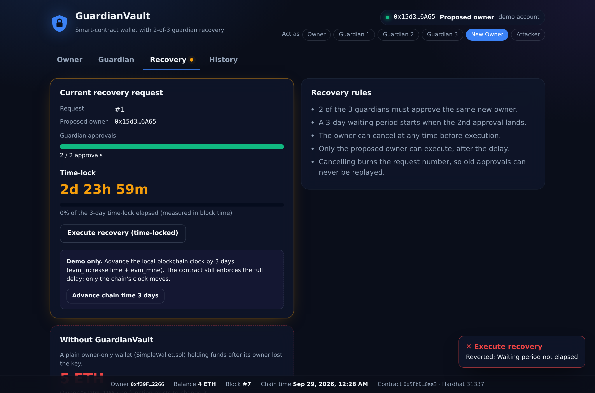

# GuardianVault

**A smart-contract wallet with guardian-assisted recovery.**


If you lose the private key to a normal Ethereum account, the funds are gone forever: there is no "forgot password". GuardianVault moves the funds into a smart contract that enforces a recovery rule on-chain: **2 of 3 trusted guardians** can appoint a new owner, but only after a **3-day time-lock** during which the real owner can cancel.



---

## How it works (in plain words)

### The problem
On Ethereum, your **private key** is the only proof that your money is yours. There is no bank, no password reset and no support desk. If the key is lost (broken phone, lost paper, death), the funds are locked forever. Analysts estimate 2.3–4 million Bitcoin have already been lost this way.

### The idea
Instead of keeping money in a normal account, you keep it inside a **smart contract**: a small program on the blockchain that holds the money and follows fixed rules nobody can change or bypass, not even its developers.

GuardianVault's rules work like a spare house key held by trusted neighbours:

1. The **owner** uses the wallet normally: deposit and send ETH.
2. The owner picks **3 guardians**: trusted people or devices (family, a second phone).
3. If the owner loses their key, **2 of the 3 guardians** can agree on a **new owner** address (the owner's new key).
4. The change only happens after a **3-day waiting period**. If it is a trick and the real owner still has their key, they can **cancel** it during those 3 days.
5. After the 3 days, **only the new owner** can finish the recovery. The old key then stops working.

Every rule is enforced by the contract itself, so no person or company has to be trusted.

### The roles

| Role | Hardhat account | What it can do |
|---|---|---|
| **Owner** | `accounts[0]` | Send ETH, replace a guardian, cancel a recovery |
| **Guardian 1–3** | `accounts[1..3]` | Propose or approve a new owner. **Cannot** touch the money |
| **New Owner** | `accounts[4]` | The owner's new key; can execute the recovery after the delay |
| **Attacker** | `accounts[5]` | A stranger; every action is rejected (used to demonstrate the defences) |

Anyone can deposit ETH into the wallet.

### What happens in a recovery, step by step

| Step | Who | Action | Result |
|---|---|---|---|
| 1 | Owner | Deposits 5 ETH | Money now sits inside the contract |
| 2 | Attacker | Tries to send the money to himself | ❌ `Not the owner` |
| 3 | - | *The owner loses their key* | - |
| 4 | Guardian 1 | Proposes "New Owner" | Request #1 created, 1 of 2 approvals |
| 5 | Guardian 1 | Tries to approve again | ❌ `Already approved this request` |
| 6 | Attacker | Tries to approve | ❌ `Not a guardian` |
| 7 | Guardian 2 | Approves the same New Owner | ✅ 2 of 2 — the 3-day timer starts |
| 8 | New Owner | Tries to take control immediately | ❌ `Waiting period not elapsed` |
| 9 | - | 3 days pass (fast-forwarded in the demo) | Timer complete |
| 10 | New Owner | Executes the recovery | ✅ New Owner is now the owner |
| 11 | Old owner key | Tries to send money | ❌ `Not the owner` - the lost key is now useless |

If the owner still had their key, they could press **Cancel recovery** at any time before step 10. The request number is then "burned", so its approvals can never be reused.

For comparison, the project also includes **SimpleWallet**, a plain wallet with no recovery. When its owner loses the key, its 5 ETH are locked forever. The demo shows this in the Recovery tab under *Without GuardianVault*.

### How the "3 days" is measured, and how the demo skips it

The contract never reads a real clock. It only knows the **timestamp written inside each block**. When the 2nd guardian approves, the contract stores:

```solidity
executionTime = block.timestamp + 3 days;
```

and execution is only allowed when:

```solidity
require(block.timestamp >= recoveryRequest.executionTime, "Waiting period not elapsed");
```

Our blockchain is a **private test chain running on our own PC** (`npm run node`), so we are allowed to move its clock. The **Advance chain time 3 days** button (or `npm run fast-forward`) sends two commands to that local chain:

1. `evm_increaseTime(259200)`: add 3 days (259,200 seconds) to the chain's clock.
2. `evm_mine`: create a new block, which is stamped 3 days later.

The newest block now says "3 days later", so the contract's check passes. **The contract code is unchanged and still demands the full 3 days**; only the test chain's calendar moved.

**This is impossible on real Ethereum.** There, block timestamps are set by the network (one slot every 12 seconds) and no single party can change them, so a real recovery genuinely takes 3 days.

### Security in the contract, not the website

The website warns you when your current account lacks a role, but it deliberately does **not** hide the buttons, so attacks can be demonstrated. The real protection is inside the contract (`onlyOwner`, `onlyGuardian`, the approval threshold and the time-lock). Even with a modified or completely different website, the contract rejects unauthorised actions.

Where the frontend decides who you are:
- `frontend/src/App.jsx` compares the selected account with the contract's owner: `isOwner = wallet.address === state.owner`.
- `frontend/src/components/OwnerView.jsx` shows *"You are not the owner. Owner-only actions below will be rejected by the contract - try them to see the defence."* when `isOwner` is false.
- `frontend/src/components/GuardianView.jsx` and `RecoveryView.jsx` show similar warnings for non-guardians and for accounts that are not the proposed owner.

---

## Features

- **Smart-contract wallet** - receives, holds and sends Ether.
- **Guardian recovery** - 2-of-3 guardians must propose and approve the *same* new owner.
- **Time-lock** - a mandatory 3-day waiting period after the 2nd approval prevents instant takeover.
- **Owner veto** - the owner can cancel any recovery before it executes.
- **Guardian management** - the owner can replace a guardian at any time; this auto-cancels an active recovery so a compromised guardian cannot obstruct their own removal.
- **Anti-replay** - approvals are bound to a sequential request ID, so approvals from a cancelled request can never be reused.
- **Full audit trail** - every action emits an event; the History tab reads them straight from the chain.

## Results (measured, not claimed)

| Metric | Result |
|---|---|
| Automated tests | **31 / 31 passing** (`reports/test-output.txt`) |
| Security defence tests (plan §5.1) | **7 / 7 attacks blocked**, plus 1 full successful recovery |
| Edge-case tests (plan §5.2) | 14 passing |
| Coverage — `GuardianVault.sol` | **100%** statements, lines, functions · 97% branches |
| End-to-end UI demo (headless browser) | all steps behave as specified |

### Gas: GuardianVault vs a plain wallet (Solidity 0.8.24, optimizer 200 runs)

Gas is the fee for each blockchain operation. Lower is cheaper.

| Operation | GuardianVault | SimpleWallet | Overhead |
|---|---:|---:|---:|
| Deployment (one-time) | 1,236,780 | 281,791 | +338.9% |
| Deposit ETH | 22,491 | 22,491 | +0.0% |
| Transfer ETH | 35,133 | 35,084 | +0.1% |
| Propose recovery | 165,686 | - | - |
| Approve recovery | 82,122 | - | - |
| Cancel recovery | 27,311 | - | - |
| Replace guardian | 60,993 | - | - |
| Execute recovery | 34,798 | - | - |

**Trade-off:** recoverability costs a one-time ~955k extra gas at deployment and essentially **nothing on everyday deposits and transfers**. The recovery functions cost more, but they are only used in an emergency.

## Project structure

```
contracts/   GuardianVault.sol (wallet + recovery), SimpleWallet.sol (baseline, no recovery)
test/        GuardianVault.test.js, SimpleWallet.test.js, GasAnalysis.test.js
scripts/     deploy.js (deploys + wires the frontend), fast-forward.js (demo time-jump)
frontend/    React 19 + Vite + Ethers v6 UI (Owner / Guardian / Recovery / History)
reports/     Real test output, coverage summary, gas report
docs/        Screenshots of the working UI
```

## Getting started (Windows PowerShell / macOS / Linux)

Requires **Node.js 18 or newer** (tested on Node 20, 22 and 24). The first compile downloads the Solidity compiler, so an internet connection is needed once.

Every command below is in its own box. Click the copy icon on a box, paste it into PowerShell and press Enter. Run all commands from the project folder (the one containing `package.json`).

### Step 1 - Install

Install the blockchain tools:

```powershell
npm install
```

Install the website:

```powershell
npm run frontend:install
```

`npm install` prints deprecation and "vulnerabilities" warnings from Hardhat 2's development tooling. They only affect local development tools. **Do not run `npm audit fix --force`**: it upgrades Hardhat to an incompatible major version.

### Step 2 - Compile and test

Compile the smart contracts:

```powershell
npm run compile
```

Run all tests. Expected: a gas table, then `31 passing`.

```powershell
npm test
```

Optional, the coverage report:

```powershell
npm run coverage
```

### Step 3 - Run the app (open 3 PowerShell windows)

**Window 1:** start the local blockchain. Leave this window running.

```powershell
npm run node
```

**Window 2:** deploy the contracts. This also connects the website to them automatically.

```powershell
npm run deploy
```

On a fresh chain it prints `GuardianVault deployed: 0x5FbDB2315678afecb367f032d93F642f64180aa3`.

**Window 3:** start the website.

```powershell
npm run frontend
```

Then open this address in your browser:

```text
http://localhost:5173
```

> Restarted the blockchain (Window 1)? It starts empty, so run `npm run deploy` again and refresh the page.


```
### Switching accounts

The UI has an **"Act as"** switcher that signs with the Hardhat node's built-in accounts, so you can switch between Owner, Guardians, New Owner and Attacker in one click. No MetaMask is needed, which is ideal for a timed demo.

**MetaMask (optional):** add network *Hardhat Local* (RPC `http://127.0.0.1:8545`, chain ID `31337`), import accounts 0–5 using the private keys printed by `npm run node`, then click **MetaMask** in the header. After restarting the node, use MetaMask → Settings → Advanced → *Clear activity tab data* to reset nonces.

### Troubleshooting

| Message | Fix |
|---|---|
| `running scripts is disabled on this system` (PowerShell) | `Set-ExecutionPolicy -Scope CurrentUser RemoteSigned` |
| Red banner: *No contract at the configured address* | The node was restarted; run `npm run deploy` and refresh |
| Red banner: *Cannot reach the local Hardhat node* | Start `npm run node` (Terminal 1) |
| `port 8545 already in use` | An old node is still running; close it |
| Vite fails with an esbuild error (npm 11+) | `cd frontend`, `npm approve-scripts esbuild`, `npm install` |

## Demo script (≈100 seconds)

1. **Owner** → Deposit 5 ETH, send 1 ETH to Guardian 1. ✅
2. **Attacker** → Send ETH. ❌ `Not the owner`
3. **Guardian 1** → Guardian tab → Propose *New Owner*. ✅
4. **Attacker** → Approve. ❌ `Not a guardian`
5. **Guardian 1** → Approve again. ❌ `Already approved this request`
6. **Guardian 2** → Approve. ✅ 2/2, 3-day countdown starts
7. **New Owner** → Recovery tab → Execute. ❌ `Waiting period not elapsed`
8. **Advance chain time 3 days** → countdown completes
9. **New Owner** → Execute. ✅ ownership transferred
10. **New Owner** → Owner tab → Send 1 ETH. ✅ · **Owner** (old) → Send. ❌ `Not the owner`
11. Recovery tab → *Without GuardianVault* → try to withdraw from SimpleWallet. ❌ funds locked forever

## Security design

| Threat | Defence |
|---|---|
| Outsider moves funds | `onlyOwner` on `transfer` |
| Outsider starts/approves recovery | `onlyGuardian` |
| One malicious guardian | 2-of-3 threshold |
| Guardian double-votes | per-request approval tracking |
| Replaying old approvals | monotonically increasing `requestId`; never decremented on cancel |
| Instant takeover by 2 guardians | 3-day time-lock + owner cancel |
| Wrong target sneaked in | approvals must name the same `proposedOwner` |
| Compromised guardian blocks replacement | `replaceGuardian` auto-cancels active recovery |
| Reentrancy on transfer | state is not modified after the external call; `onlyOwner` caller |

## Known limitations

- **Guardian collusion:** two colluding guardians can take over if the owner doesn't cancel within 3 days.
- **Lost key + malicious recovery:** an owner who truly lost their key cannot cancel; the delay only postpones.
- **Stolen (not lost) owner key:** a thief holding the owner key can drain funds immediately and can cancel recoveries or replace guardians. Social recovery protects against *loss*, not *theft*. Future work: daily spending limits, guardian veto on guardian changes.
- **Guardian replacement needs the owner key.** Future: guardian-voted replacement.
- **Fixed 2-of-3 and fixed 3-day delay.** Future: configurable M-of-N and delay.
- **ETH only; local testnet only; no ERC-4337.** Future: ERC-20 support, Sepolia deployment, account abstraction, factory for many wallets.

## Tech stack

Solidity ^0.8.24 · Hardhat 2 + `@nomicfoundation/hardhat-toolbox@hh2` · Ethers.js v6 · React 19 (Vite 7) · vanilla CSS · MetaMask (optional) · Hardhat local network (chain 31337).

See [`Implementation_Plan.md`](Implementation_Plan.md) for the full design and the measured results.